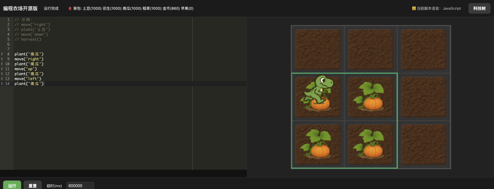
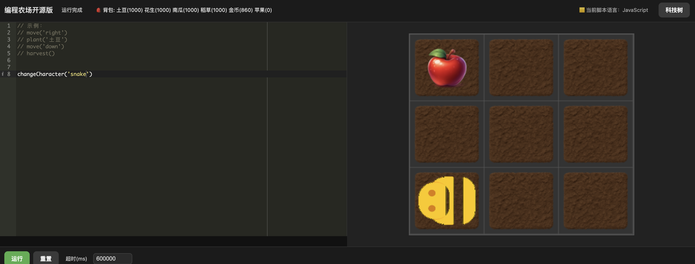
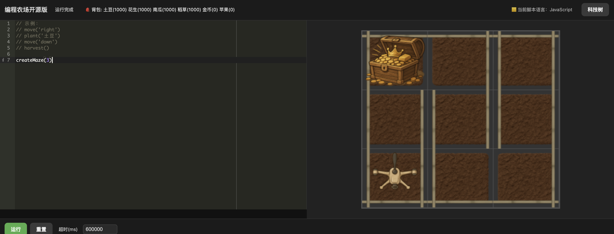
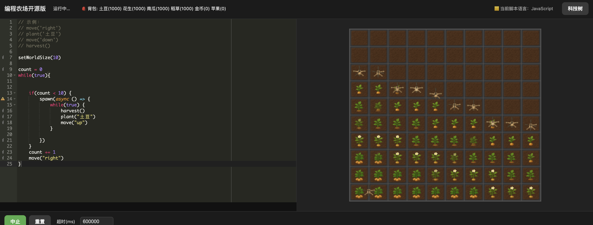

# Auto Farm

A JavaScript-based coding farm game. Inspired by The Farmer Was Replaced.

The core goal is to help players learn programming by writing code that controls characters in a 2D farm.

## Play Online
- Live demo: https://play.loki.wang

## Overview
- Control one or more characters to plant crops on a 2D map.
- Harvest items to unlock a technology tree (skills and features).
- Unlocks grant new scripting commands and additional gameplay options.

## Current Features
- Characters: `Dinosaur`, `Drone` ， `Snake`; character switching is supported.
- Crops: `Potato`, `Pumpkin`.
- Scripting: supports basic JavaScript syntax.
- Multi-character spawning: supported (known issues remain).
- Technology tree: basic tree implemented; balancing and UI tuning pending.

## Supported Game Modes
- Mode 1: Classic farming
- Mode 2: Adjacent pumpkins aligned in a straight forward direction merge
  - 
- Mode 3: Snake mode
  - 
- Mode 4: Maze mode
  - 
- Mode 5: Multi-threaded mode
  - 

## Roadmap
- Core game features:
  - Save and Load game progress.
- More gameplay:
  - Maze mode.
  - Snake mode.
  - Crop maturity affecting other crops' stats.

## Known Issues
- Spawning multiple characters has bugs in some scenarios.

## Quick Start
- Requirements:
  - Modern browser.
  - Optional: a static file server (assets load relative to `index.html`).
- Run locally:
  - Serve the project root with a static server, then open the page:
    - `python3 -m http.server 8000` (Python)
    - `npx http-server -p 8000` (Node.js)
  - Open `http://localhost:8000/index.html`.
- Alternatively, open `index.html` directly if your browser permits local asset loading.

## Project Structure
- `index.html`: entry HTML page.
- `js/main.js`, `js/game.js`: game bootstrap and loop.
- `js/engine/`: core engine modules (map, layers, crops, worker bridge).
- `js/unlock/`: technology tree UI and logic.
- `asset/`: images and third-party libraries (`pixi.min.js`, `ace.js`).
- Top-level helpers: `entity.js`, `item.js`, `hat.js`, `runner.js`, `unlock.js`.

## Technology
- Rendering: `PIXI.js`.
- Code editing: `Ace`.
- Language: plain JavaScript.

## How It Works
- Write JavaScript to control characters (movement, planting, harvesting).
- Harvested items contribute to unlocks in the tech tree.
- Unlocks expose new commands and expand gameplay.

## Contributing
- Issues and pull requests are welcome.

## Acknowledgements
- Inspired by "Programming Farm". Thanks to its ideas and community.

